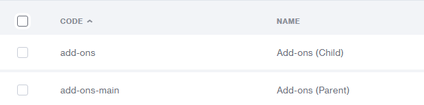
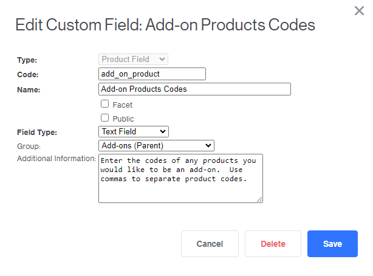
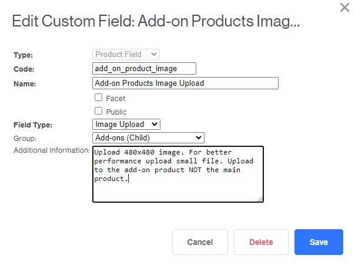
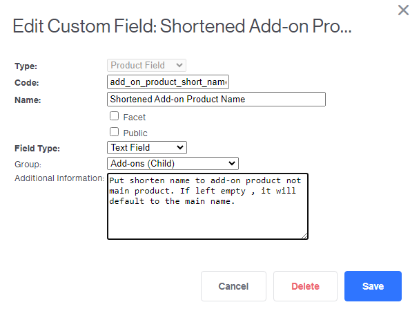

# Miva Merchant - ADPM (Add-Product Multiple) on PROD Page

## Table of Contents
- [Description](#description)
- [Goals](#goals)
- [Limitations](#limitations)
- [Implementation](#implementation)
    - [Step 1 -- Setting Up The Required Custom Fields](#step-1----setting-up-the-custom-fields-and-custom-groups)
    - [Step 2 -- Add-on Product Template](#step-2----add-on-product-template)
    - [Step 3 -- ADPR vs ADPM - Working Around The Attribute Machine](#step-3----adpr-vs-adpm---working-around-the-attribute-machine)
    - [Step 4 -- Handling Price changes](#step-4----handling-price-changes)
    - [Step 5 -- AJAX request](#step-5----ajax-request)
    - [Step 6 -- Error Handling](#step-6----error-handling)

## Description

This is a walk through on how to implement add-on products onto main product pages (PROD Page) in Miva Merchant eccomerce stores that use shadows readytheme. This works in tandem with the attribute machine and retains an "out-of-box" feel of shadows readytheme. 

[Live Example](https://www.weistec.com/m157_ecu_tune.html). 
NOTE: This version may have additional functionality and styling that is not covered here. 


## Goals

- **Create An Easier, More Efficient And Enjoyable User Experience.** 

    The main goal of this project is to allow customers to add recommended or related products to their basket alongside a main product all in a single form submit. This makes the user shopping experience quicker, more efficient and more enjoyable. More items added to cart lead to increase sales average.

- **More Accurate Inventory Tracking And Discount/Tax Calculation**

    Prior to this project, we used product attributes to imnplement add-on products. This caused the add-on products to inherit certain characteristics from the main product like tax status, discounts, etc. By using the ADPM action each product becomes their own line item in the basket and thus doesn't inherit anything from the main product. Because of this inventory tracking and  discount calculations are more accurate.

- **Error Handling**

    We added error handling for this project. Errors display in minibasket.

- **Retain Attribute Machine Functionality**

    ADPM does not work with the attribute machine at the time of writing. This project works around this limitation to keep the same user experience as before.

## Limitations
- **Discounts on add-on products don't display on product page**

Discounts don't display on product page, but once added to cart discounts are applied and viewable in basket.

- **Attributes for add-on products aren't supported in this walkthrough**

ADPM does support attributes for multiple products so it is possible to implement it, but we thought that doing so would take up too much space on screen. Because of this we chose not to do so. 

## Implementation

### Step 1 -- Setting Up The Custom Fields And Custom Groups

Custom fields are a powerful tool to customize your eccomerce store. For more info read Miva's Documentation on [Custom Fields](https://docs.miva.com/template-language/custom-field-reference-documentation).

For this project we use three custom fields: add_on_product, add_on_product_image, add_on_product_short_name. For better Admin work flow we will seperate these custom fields into the custom field groups: Add-ons (Parent), Add-ons (Child)  If you don't want your add-on products to have images, only use add_on_product.

You can create a new custom field group in Home > Utility Settings > Custom Field Groups.


This is the set up



You can create a new custom field in Home > Utility Settings > Custom Fields.

- **add_on_product**
    
    This field is for main products and is part of the "Add-on (Parents)" custom field group. This custom field will hold a string of product codes of products that you would like to be add-on products. Each product code should be separated by a comma. The following is the set up.

    

- **add_on_product_image**

    This custom field is to be used on the add-on product itself and is part of the "Add-ons (Child). This field holds an image of the add-on product. In this project, the add-on image is 480 x 480 pixels and has a lower resolution for optimal performance. The size can  The following is  the set up.

    

- **add_on_product_short_name**

    This custom field is to be used on the add-on product itself. This is to customize how you want the add-on product name to appear. It is completely optioonal, but useful if your add-on product has a long name that would take up too much space on the screen.

    


### Step 2 -- Add-on Product template

This template is based on a [MIVA code sample](https://docs.miva.com/code-samples/product-multi-add-as-attributes). We are not going to use the javascript from this resource. We will handle quantities in step 3. This template should be put under product attributes in the PROD page template.

```xml
<div class="product-add-ons">
<mvt:comment><!--Call in Add-On Products--></mvt:comment>
<mvt:item name="customfields" param="Read_Product_Code(l.settings:product:code, 'add_on_product',g.add_on_codes)" />

<mvt:if expr="NOT ISNULL g.add_on_codes">
    <mvt:comment><!-- Make arrray of add-on product codes --></mvt:comment>
	<mvt:assign name="g.array_count" value="miva_splitstring( g.add_on_codes, ',', g.codes_array, '' )" />

	<mvt:if expr="miva_array_elements(g.codes_array) GT 0">
	<mvt:assign name="g.count" value="2" />

	<h3>Optional Add-Ons</h3>
		<div class="add_on_product">
		<mvt:foreach iterator="add_on_code" array="global:codes_array">
            <mvt:comment> <!--Load add-on product --></mvt:comment>
			<mvt:do file="g.Module_Library_DB" name="l.success" value="Product_Load_Code( l.settings:add_on_code, l.settings:add_on:product )" />
            <mvt:comment> <!-- Get add-on image and shortened names --></mvt:comment>
            <mvt:item name="customfields" param="Read_Product_Code(l.settings:add_on_code, 'add_on_product_image' ,l.settings:add_on_image)" />
            <mvt:item name="customfields" param="Read_Product_Code(l.settings:add_on_code, 'add_on_product_short_name', l.settings:add_on:short_name)" />
            <mvt:comment> <!--Formats prices--> </mvt:comment>
			<mvt:do name="l.settings:add_on:product:formatted_price" file="g.Module_Root $ g.Store:currncy_mod:module" value="CurrencyModule_AddFormatting( g.Store:currncy_mod, l.settings:add_on:product:price )" />

			

			<label title="&mvt:add_on:product:name; + &mvt:add_on:product:formatted_price;">
            <mvt:comment><!-- data-add_on_price will be used to update price --></mvt:comment>
            <input type="checkbox" name="Products[&mvt:global:count;]:code" id="add_on_&mvt:global:count;" value="&mvt:add_on:product:code;" data-add_on_price="&mvt:add_on:product:price;"> 
                <mvt:if expr="NOT ISNULL l.settings:add_on_image">
                     
                </mvt:if>
                <mvt:if expr="NOT ISNULL l.settings:add_on:short_name">
                    <span class="u-text-center">&mvt:add_on:short_name;</span> + &mvt:add_on:product:formatted_price;
                <mvt:else>
                    <span class="u-text-center">&mvt:add_on:product:name;</span> + &mvt:add_on:product:formatted_price;
                </mvt:if>  
            </label><br>

			
			<mvt:assign name="g.count" value="g.count + 1" />
		</mvt:foreach>
		</div>

	</mvt:if>
    <mvt:comment><!-- Outputs add-on product quantities --></mvt:comment>
	<div id="add_on_quantity"></div>

</mvt:if>

</div>


```


### Step 3 -- ADPR vs ADPM - Working Around The Attribute Machine

**A little background info on MIVA Actions and Forms**

Miva Merchant uses hidden inputs named actions that let their engine know how to handle forms and each form has its own required inputs and format. For example, Login form uses the action LOGN and requires email and password. A full list of actions can be found [here](https://gist.github.com/steveosoule/29028906236ee5dbc561ac7ac858fc56). Here we are going to focus on the action ADPR and ADPM and their required inputs and form formats. 


**ADPR Structure**

```html
<!-- Compatible with Attribute machine -->
<input type="hidden" name="Old_Screen"                              value="PROD">
<input type="hidden" name="Old_Search"                              value="">
<!-- Action -->
<input type="hidden" name="Action"                                  value="ADPR">
<input type="hidden" name="Category_Code"                           value="rivian">
<input type="hidden" name="Offset"                                  value="">
<input type="hidden" name="AllOffset"                               value="">
<input type="hidden" name="CatListingOffset"                        value="">
<input type="hidden" name="RelatedOffset"                           value="">
<input type="hidden" name="SearchOffset"                            value="">

<!-- Single Product only -->
<input type="hidden" name="Product_Code"                            value="main-product">
<input type="hidden" name="Product_Attributes[1]:code"              value="size">
<input type="hidden" name="PProduct_Attributes[1]:template_code"    value="size-template">
<input type="hidden" name="Product_Attributes[1]:value"             value="small">
```

**ADPM**
```html
<!-- Not Compatible with Attribute Machine -->
<input type="hidden" name="Old_Screen" value="PROD">
<input type="hidden" name="Old_Search" value="">
<!-- Action -->
<input type="hidden" name="Action" value="ADPM">
<input type="hidden" name="Category_Code" value="mb">
<input type="hidden" name="Offset" value="">
<input type="hidden" name="AllOffset" value="">
<input type="hidden" name="CatListingOffset" value="">
<input type="hidden" name="RelatedOffset" value="">
<input type="hidden" name="SearchOffset" value="">

<!-- Main Product -->
<input type="hidden" name="Products[1]:code"                        value="main-product">
<input type="hidden" name="Products[1]:quantity"                    value="1">
<input type="hidden" name="Products[1]:attributes[1]:code"          value="size">
<input type="hidden" name="Products[1]:attributes[1]:template_code" value="size-template">
<input type="hidden" name="Products[1]:attributes[1]:value"         value="small">
<input type="hidden" name="Products[1]:subterm_id"                  value="test-subscription">

<!-- Additional Product -->
<input type="hidden" name="Products[2]:code"                        value="add-on-product">
<input type="hidden" name="Products[2]:quantity"                    value="1">
<input type="hidden" name="Products[2]:attributes[1]:code"          value="size">
<input type="hidden" name="Products[2]:attributes[1]:template_code" value="size-template">
<input type="hidden" name="Products[2]:attributes[1]:value"         value="small">

```

By default the PROD page (Product Display page) uses a form that uses the action ADPR (Add Product) to add products to cart. The Attribute Machine recognizes the form format and all the expected functionality runs normally, but if we want to be able to add multiple products we will have to use the action ADPM (Add Product Multiple) and its form which the attribute machine doesn't recognize. The solution here is to load in the form in ADPR format and convert it ADPM format when the user submits the form by clicking the add to cart button. [rguisewite](https://www.miva.com/forums/forum/online-merchants/miva-merchant-9/692445-error-unable-to-locate-form-for-inventory-attributes-when-setting-up-multiadd?p=692534#post692534) made the original script that made this possible. I slightly changed it to fit our needs but it is the same script.

**NOTE:** For this script to work you must you must give your add-to-cart form the id "AddToCartForm" and the Quantity input the id "Quantity"

```html
<form id="AddToCartForm" name="add" method="post" action="&mvte:urls:BASK:auto;">

    <!-- make sure the Product_Code hidden input is here -->
    ...

    Quantity: <input type="tel" id="prod_quantity"
```

Here is the script

```js
function write_quantity_inputs()
    {
        var i, i_len, element_input, element_quantity, elementlist_inputs, element_add_on_quantity, element_form;

        element_form                = document.getElementById( 'AddToCartForm' );
        element_quantity            = document.getElementById( 'Quantity' );
        element_add_on_quantity        = document.getElementById( 'add_on_quantity' );
        elementlist_inputs            = document.querySelectorAll( '.add_on_product input' );

        if ( !element_form || !element_quantity || !element_add_on_quantity )
        {
            return;
        }

        element_add_on_quantity.innerHTML = '';

        for ( i = 0, i_len = elementlist_inputs.length; i < i_len; i++ )
        {
            if ( elementlist_inputs[ i ].type.toLowerCase() === 'checkbox' && elementlist_inputs[ i ].checked )
            {
                element_input            = document.createElement( 'input' );
                element_input.type        = 'hidden';
                element_input.name        = 'Products[' + ( i + 2 ) + ']:quantity';
                element_input.value        = element_quantity.value;

                element_add_on_quantity.appendChild( element_input );
            }
        }

        /* Convert Product_Code, Quantity, and Product_Attributes[ over to the Multi-Add-To-Basket format */

        for ( i = 0, i_len = element_form.elements.length; i < i_len; i++ )
        {
            if ( !element_form.elements[ i ].hasAttribute( 'name' ) || element_form.elements[ i ].name.length === 0 )        continue;
            else if ( element_form.elements[ i ].name.toLowerCase() == 'product_code' )                                        element_form.elements[ i ].name = 'Products[ 1 ]:code';
            else if ( element_form.elements[ i ].name.toLowerCase() == 'quantity' )                                            element_form.elements[ i ].name = 'Products[ 1 ]:quantity';
            else if ( element_form.elements[ i ].name.toLowerCase().indexOf( 'product_attributes[' ) == 0 )                    element_form.elements[ i ].name = 'Products[ 1 ]:attributes' + element_form.elements[ i ].name.substring( 18 );
        }

        if ( element_form.elements.Action.value != 'ATWL' )
        {
            element_form.elements.Action.value = 'ADPM';
        }

        return true;
    }

    document.addEventListener( 'DOMContentLoaded', function( event )
    {
        document.getElementById( 'AddToCartForm' ).addEventListener( 'submit', function( event ) { write_quantity_inputs(); return true; }, false );
    }, false );
```

### Step 4 -- Handling Price changes


### Step 5 -- AJAX request


### Step 6 -- Error Handling


## Admin Workflow

### Setting up an Add-on Product


### Setting up the Main Product